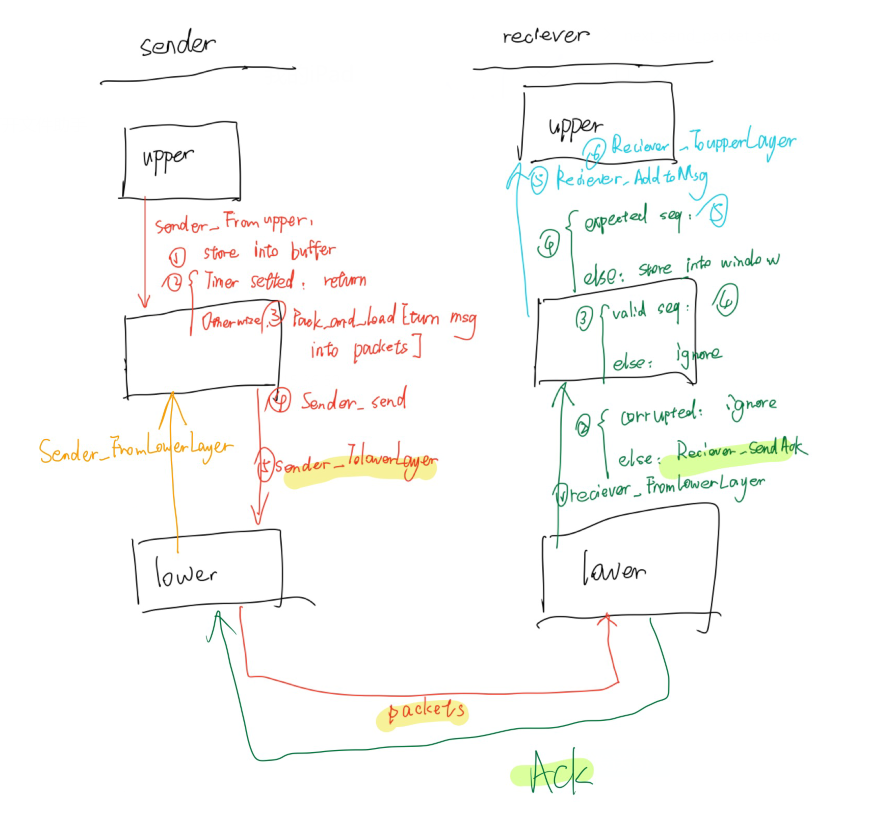

# lab1-Reliable Data Transport Protocol

- name: Zhang Ao
- Student ID：518021910368
- email: assassin-desmond@sjtu.edu.cn

## 1. the design of packet header

- packet header is **5 bytes** of length, whose detail structure is below：

	| <-  checksum  ->        | <-payload size->           | <-sequence number->                 | <- a constant ->          |
	| ----------------------- | -------------------------- | ----------------------------------- | ------------------------- |
	| **<-     1 byte    ->** | **<-      1 byte      ->** | **<-         1 byte            ->** | **<-     1 byte      ->** |

- **checksum**:  generated check code

- **payload size**: actual vaild size of this packet

- **sequence number**: index of this packet, which helps arrange packets in order. Furthermore, it ranges from 0 to 60 and the highest two bits of this byte indicates whether it's a head or a tail of a message.

	 e.g. 0000 1000 implies a packet with seq=8 and it's neither a head nor a tail of a message

	​	1000 0010 implies a packet with seq=2 and it's a head of a message but not a tail.

- **a constant**: a second safeguard which helps to recognize whether this packet is corrupted. its default value is 7( it can be set randomly ranging from )

## 2. work flow (choose strategy of selective repeat)



## 3. details of implementation

### 3.1 sender

​	In sender, there are a window with size 10  storing the packets and a buffer based on queue storing the messages. A timer is set in the sender when it needs to waiting for ack from receiver. e.g. 1. getting a message from upper and timer has not been set,  2. getting the expected ack and need to wait for another ack, 3. previous timer expires and need to resend the packet. 

only when ack of the ***window_cursor*** corresponding packet has received , the ***window_cursor*** will move . every time sending a packet, the ***next_send_packet_seq*** increases. every time pack a packet ,the ***next_packet_seq*** increases. ***n_pkt_window*** which indicates the number of existing packets in window will change when window slides or new packets are packed.

### 3.2 receiver

​	In receiver, there are also a window with size 10 storing packet and a message helping to combine the packets.  furthermore， there is a ***expect_seq*** indicating what packet receiver is waiting.

​	only when get the expected valid packet（whose seq equals to the ***expect_seq***） , the ***window_cursor***  moves and ***expect_seq***  increases. And window sliding will result in packets combination . Once a message reaches its end , receiver will deliver it to upperlayer and flush the ***cur_Msg***. 

## 4.some tips:

 1. 【about sequence size? 】

	to minimize the header of  a packet, just use one byte to represent the sequence number. In order to find a packet's position in windows,  make it  times of window's size so that we can locate a packet as quick as possible. e.g. we get  a packet with seq=27, we'll quickly know its position in the windows will be windows[7].

	furthermore, to help distinguish packets from different messages, use the highest two bits of seq for head-bit and tail-bit. therefore, the seq is set to range from 0 to 59. 

	with a range size of 60 bigger than twice of the window size, it can be safe for distinguish whether a seq is wanted.

	2. 【about how to know if a packet is not wanted?】

	i set a variable named "window_cursor" on both sender and receiver.  when a packet is received, firstly check its checksum, and then check if the constant changes. If passed , then check whether the packet seq-windows[window_cursor] ranges from 0 to 9 or from -59 to -50 [distance is less than window size]. and at last , check the corresponding packet in the windows to see whether it has been received.

	3. 【why use a constant?】

	Based on my special design of sequence number, when corruption happens, it's probably that a packet can pass both the ***checksum*** check and seq check, which may result into a disorder. To prevent this, I have to expand my header from size 4 to 5,  to guarantee that situation become less possible. And it turns out it works very well—— I can almost pass all the tests: 20 tests and 20 successes, big improvement from origin one without the constant: 6 tests and 4 successes.

## 5. results

```shell
./rdt_sim 1000 0.1 100 0.3 0.3 0.3 0

## Simulation completed at time 4120.19s with
        995530 characters sent
        995530 characters delivered
        59412 packets passed between the sender and the receiver
## Congratulations! This session is error-free, loss-free, and in order.
```

```shell
./rdt_sim 1000 0.1 100 0.15 0.15 0.15 0

## Simulation completed at time 1872.24s with
        987506 characters sent
        987506 characters delivered
        38327 packets passed between the sender and the receiver
## Congratulations! This session is error-free, loss-free, and in order.
```

